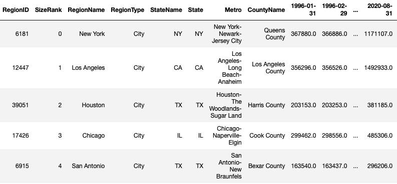
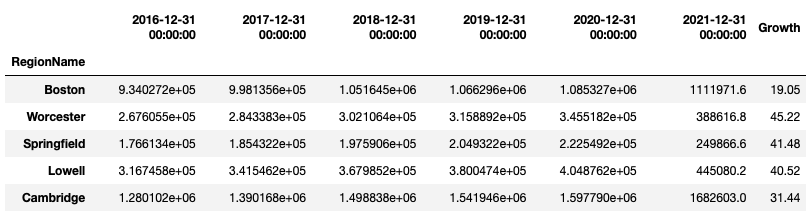

# Opening a Gym in Massachussets

## The Problem
Massachusetts' population grew to slightly more than 7 million people last year, enjoying the largest increase of any New England state over the last 10 years at 7.4 percent.1 That's wonderful growth, however, chronic conditions contribute to 56% of all mortality in Massachusetts and over 53% of all health care expenditures ($30.9 billion a year).2 Some of these conditions are managable when an individual commits to a healthy regime, which of course involves physical activity. This is based off the fact that physical _inactivity_ is a risk factor for cardiovascular disease, type 2 diabetes, cancer of the colon and breast, obesity, hypertension, bone and joint diseases, and depression.3

At the moement, 24% of the Massachusetts population (~1.6 million residents) are visiting health clubs - of which there are approximately 1,003.4 Therefore, there is approximately another 1/2 of the population that suffers from chronic conditions that haven't utilized a health club. Furthermore, health clubs in Massachusetts are currently driving growth of $652 million in revenue and $37.4 million paid in payroll taxes.4

## The Solution
Based off the above problem, a reasonable solution would be for social entrepeneurs to open health clubs in potential markets (growing neighborhoods within Massachusetts). Growing neighborhoods are preferred so that the entrepeneurs could achieve a successful business outcome, i.e. make a profit.

To predict market growth, housing price data will be used as a proxy. This is based on the assumption that as the demand for housing increases in a certain neighborhood, then the population of that neighborhood is increasing. Therefore, average home price growth will be used as a primary indicator of potential markets.

Another important factor to consider when opening a business is competition. There are many big franchise gyms that currently exist within Massachusetts, and so when considering a location for a new health club, it would be wise to not set up shop beside a big player. Venue data from Foursquare will be used to help identify competition heavy locations that should be avoided.

## Data
- Massachusetts housing price data using the [Zillow Home Value Index (ZHVI)](https://www.zillow.com/research/data/)
- Venue data using the [Foursquare API](https://developer.foursquare.com)
- Geospatial data from [United-States-Zip-Codes.org](https://www.unitedstateszipcodes.org/zip-code-database/):

## Methodology & Results
The methodology involved two major steps: identify top growth neighborhoods in Massachusetts in terms of housing price growth over the past 5 years and then cluster those top growth neighborhoods based on venue data acquired from the Foursquare API. The technical steps for all this can be found in the accompanying notebook, but below is a summary.

### Identify High Growth Neighborhoods
In order to identify high growth neighborhoods, I utilized housing prices as a proxy for growth. I downloaded the Zillow housing price dataset which involved monthly average housing prices from 1996 to 2021. 

I wrangled the above dataset and derived the average yearly housing prices per neighborhood from 2015-2021 and then calculated the percentage growth over a 5 year period.

I calculated the 90th percentile of growth rates for all neighborhoods in Massachusetts and demarcated the growth rates on this bar plot:

After this filtering down for high growth neighborhoods, these are the potential locations for a new gym:

### Identify Potential Competition
I pulled venue data using the Foursquare API and mapped out all Gyms and Fitness Centers in the aforementioned potential locations in order to identify competitors:

### Cluster Nieghborhoods
After all of the above,

# References
> 1 Stout, M. (April 26, 2021) _'Good news for Massachusetts': Populations tops 7 million as state keeps 9 congressional seats after 2020 Census_ from: https://www.bostonglobe.com/2021/04/26/metro/massachusetts-will-keep-9-congressional-seats-after-2020-census/
>
> 2 MDPH, Massachusetts Deaths 2014. Available at: http://www.mass.gov/eohhs/docs/dph/research-epi/death-data/death-report-2014.pdf.
>
> 3 Warburton, Darren ER, Crystal Whitney Nicol, and Shannon SD Bredin. Health benefits of physical activity: the evidence. Canadian medical association journal. 2006: 801-809.
>
> 4 IHRSA. The Global Health & Fitness Association. From: https://www.ihrsa.org/industry-leadership/state-advocacy/massachusetts/
